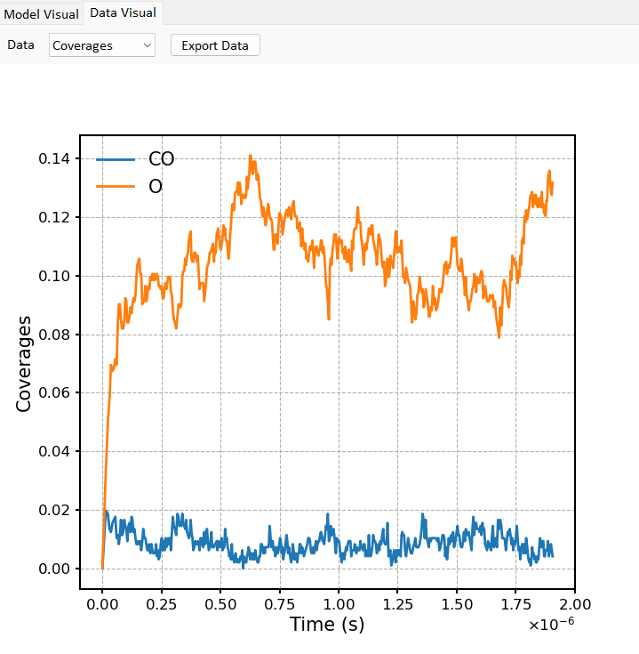
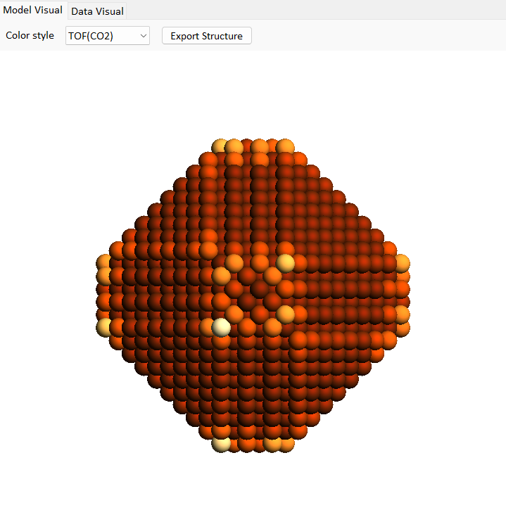

Language : 🇺🇸 | [🇨🇳](./readme.zh-CN.md)

# MOSP: Multi-scale Operando Simulation Package

> **Note**  
> *2024.6.10*: **Release Candidate 1 of MOSP 2.0 (2.0-rc.1)** has been released. If you encouter any issues during usage, please contact us via a new [issue](https://github.com/mosp-catalysis/MOSP/issues/new) or [email](https://www.x-mol.com/groups/gao_yi/contact_us)

## About MOSP  

MOSP is a Multi-scale Operando Simulation Package that can be utilized to investigate the dynamic structure-property relationship of nanoparticles in catalytic reaction atmospheres. MOSP comprises two main modules: the Multiscale Structure Reconstruction (MSR) module and the Kinetic Monte Carlo (KMC) module. Users can input reaction conditions, nanoparticle size, and other parameters through through the graphical user interface (GUI). With MSR, users can obtain the structure of nanoparticles in a realistic environment within seconds, and simulate the their catalytic behavior on a macroscopic time scale using KMC. The KMC module also allows to run independently by reading in initial structure files in xyz format. 

MOSP is developed and maintained by [Yi Gao's group](https://www.x-mol.com/groups/gao_yi), and we welcome engaging in discussions. The major contributors: Beien Zhu, Lei Ying, Yu Han, Xiaoyan Li, Jun Meng, Yi Gao (in no particular order). 

## Installation

1. Install python (python3.8 is recommended)  
  Install python3.8 directly from [python website](https://www.python.org/downloads/release/python-3816/). Or install [Anaconda](https://www.anaconda.com/download) and build python3.8 environment.

2. Download the project  
   - Method 1: clone project using [git](https://git-scm.com/downloads)  

        ```python
        git clone https://github.com/mosp-catalysis/MOSP.git  
        cd MOSP  
        ```  

   - Method 2：Download [Zip](https://github.com/mosp-catalysis/MOSP/archive/refs/heads/main.zip)
  
3. Install the dependencies (If you are using a 32-bit operating system or a different version of Python, please download the corresponding .whl file for PyOpenGL from [this website](https://www.lfd.uci.edu/~gohlke/pythonlibs/#pyopengl).)  
    ```python
    # (If use anaconda) create anaconda environment
    conda create -n mosp_env python=3.8
    conda activate mosp_env
    # Install the dependencies
    pip install data/PyOpenGL-3.1.6-cp38-cp38-win_amd64.whl  
    pip install data/PyOpenGL_accelerate-3.1.6-cp38-cp38-win_amd64.whl  
    pip install -r requirements.txt  
    ```
4. Run  
    ```python
    # (If using an Anaconda environment, activate it before running)
    conda activate mosp_env
    # Run main program (ensure you are in the current directory)
    python main.py
    ```

## Usage  

1. Demonstration of the MOSP workflow
    

2. MSR module
     
  Inputs: lattice parameters, particle size (radius), reaction atmosphere, surface parameters (surface energy, adsorption energy of various gases/adsorbates, adsorption entropy, and lateral interactions)
  
  Outputs: nanoparticle structure (exportable as .xyz file), statistics on surface site types (stored in data/OUTPUT/faceinfo.txt)

3. KMC module、
  - Inputs (using MSR structure as an initial structure)
    
    Define species (**adsorbates**+products) -> Define events + lateral interactions
    
    The adsorbate definition sub-window provides the parameters needed for calculating event rates:

    
    
    

  - Outputs
    After KMC calculations, raw data will be stored in the data/OUTPUT/ directory. Subsequently, preliminary data processing can be done internally in MOSP, including outputs such as:
    
    
    Coverage and TOF trends will be displayed on the *Data Visual* panel, and data points can be exported in csv/xlsx/json formats.

    
    

    Based on GCN and the relative activity of each site (normalized site-specific TOF), particles can be colored in the *Model Visual* panel, and data can be exported as .xyz files, with corresponding GCN/TOF stored in the last column of the coordinate file.


4. Example Files
   The examples/ folder provides example input files for CO oxidation reactions on Au and Pt (in .json format). These files can be loaded via the menu bar using File -> Load. More examples will be added in future versions.

## 版本
- Version 2.0: Introduces a multi-step KMC module with customizable events, along with visualization panels and data export functionality
- Version 1.0: Basic functionalities with MSR and KMC module.

## References  

### **MSR**

[1] Zhu B, Xu Z, Wang CL, Gao Y,* "Shape Evolution of Metal Nanoparticles in Water Vapor Environments." *Nano Lett.* **2016**, *16*, 2628-2632. [<a href="https://pubs.acs.org/doi/abs/10.1021/acs.nanolett.6b00254">Link</a>]

[2] Zhu B, Meng J, Yuan W, Zhang X, Yang H, Wang Y,* Gao Y,* "Reshaping of Metal Nanoparticles in Reaction Conditions." *Angew. Chem. Int. Ed.* **2020**, *59*, 2171-2180. (minireview) [<a href="https://onlinelibrary.wiley.com/doi/abs/10.1002/anie.201906799#:~:text=The%20shape%20of%20metal%20nanoparticles%20%28NPs%29%20is%20one,fully%20understanding%20catalytic%20mechanisms%20at%20the%20molecular%20level.">Link</a>]


### **KMC**  

[1] Li X, Zhu B,* Gao Y,* "Exploration of Dynamic Structure–Activity Relationship of a Platinum Nanoparticle in the CO Oxidation Reaction" *J. Phys. Chem. C* **2021**, *125*, 19756-19762. [<a href="https://pubs.acs.org/doi/10.1021/acs.jpcc.1c05339">Link</a>]

## Related Publications  

[1] Zhu B, Meng J, Gao Y,* "Equilibrium Shape of Metal Nanoparticles under Reactive Gas Conditions." *J. Phys. Chem. C* **2017**, *121*, 5629-5634. [<a href="https://pubs.acs.org/doi/10.1021/acs.jpcc.6b13021">Link</a>]

[2] Zhang X, Meng J, Zhu B,* Yu J, Zou S, Zhang Z, Gao Y,* Wang Y,* "In situ TEM Studies of Shape Evolution of Pd Nanoparticles under Oxygen and Hydrogen Environment at Atmospheric Pressure." *Chem. Comm.* **2017**, *53*, 13213-13216. (back cover) [<a href="https://pubs.rsc.org/en/content/articlelanding/2017/cc/c7cc07649e">Link</a>]

[3] Meng J, Zhu B,* Gao Y,* "Shape Evolution of Metal Nanoparticles in Binary Gas Environment." *J. Phys. Chem. C* **2018**, *122*, 6144-6150. [<a href="https://pubs.acs.org/doi/10.1021/acs.jpcc.8b00052">Link</a>]

[4] Duan M, Yu J, Meng J, Zhu B,* Wang Y,* Gao Y,* "Reconstruction of Supported Metal Nanoparticles in Reaction Conditions." *Angew. Chem. Int. Ed.* **2018**, *57*, 6464-6469. (minireview) [<a href="https://www.onlinelibrary.wiley.com/doi/abs/10.1002/anie.201800925">Link</a>]

[5] Zhang X, Meng J, Zhu B,* Yuan W, Yang H, Zhang Z, Gao Y,* Wang Y,* "Unexpected N<sub>2</sub> Induced Refacetting of Palladium Nanoparticles." *Chem. Comm.* **2018**, *54*, 8587-8590. [<a href="https://pubs.rsc.org/en/content/articlelanding/2018/cc/c8cc04574g">Link</a>]

[6] Chmielewski A, Meng J, Zhu B, Gao Y, Guesmi H, Prunier H, Alloyeau D, Wang G, Louis C, Dalannoy L, Afanasiev P, Ricolleau C, Nelayah J,* "Reshaping Dynamics of Gold Nanoparticles under H<sub>2</sub> and O<sub>2</sub> at Atmospheric Pressure." *ACS Nano* **2019**, *13*, 2024-2033. [<a href="https://pubs.acs.org/doi/abs/10.1021/acsnano.8b08530?src=recsys">Link</a>]

[7] Du J, Meng J, Li X, Zhu B, Gao Y,* "Multiscale Atomistic Simulation of Metal Nanoparticles in Working Conditions." *Nanoscale Adv.* **2019**, *1*, 2478-2484. [<a href="https://pubs.rsc.org/en/content/articlepdf/2019/na/c9na00196d?page=search#:~:text=Multiscale%20atomistic%20simulation%20of%20metal%20nanoparticles%20under%20working,conditions%20have%20been%20discovered%20in%20recent%20years%2C%20which">PDF</a>]

[8] Yuan L, Zhu B, Zhang G,* Gao Y,* "Reshaping of Rh Nanoparticles in Operando Conditions." *Catal. Today* **2020**, *350*, 184-191. [<a href="https://www.sciencedirect.com/science/article/abs/pii/S0920586119303141">Link</a>]

[9] Tang M, Zhu B, Meng J, Zhang X, Yuan W, Zhang Z, Gao Y,* Wang Y,* "Pd-Pt Nanoalloy Transformation Pathways at Atomic Scale." *Mater. Today Nano* **2018**, *1*, 41-46. [<a href="https://www.sciencedirect.com/science/article/pii/S2588842018300324">Link</a>]

[10] Li X, Zhu B, Qi R, Gao Y,* "Real-time Simulation of Nonequilibrium Nanocrystal Transformation." *Adv. Theory Simul.* **2019**, *2*, 1800127.[<a href="https://onlinelibrary.wiley.com/doi/abs/10.1002/adts.201800127">Link</a>]

[11] Wu Z, Tang M, Li X, Luo S, Yuan W, Zhu B,* Zhang H, Gao Y, Wang Y,* "Surface faceting and compositional evolution of Pd@Au core−shell nanocrystals during in situ annealing." *Phys. Chem. Chem. Phys.* **2019**, *21*, 3134-3139. [<a href="https://pubs.rsc.org/en/content/articlelanding/2019/cp/c8cp07576j">Link</a>]

[12] Zhu B, Qi R, Yuan L, Gao Y,* "Real-time Simulation of the Atomic Ostwald Ripening of TiO<sub>2</sub> Supported Nanoparticles." *Nanoscale* **2020**, *12*, 19142-19148. [<a href="https://pubs.rsc.org/en/content/articlelanding/2020/nr/d0nr04571c">Link</a>]

[13] Duan X, Li X, Zhu B,* Gao Y,* "Identifying the morphology of Pt nanoparticles for the optimal catalytic activity towards CO oxidation." *Nanoscale* **2022**, *14*, 17754-17760. [<a href="https://pubs.rsc.org/en/content/articlelanding/2022/NR/D2NR04929E">Link</a>]


